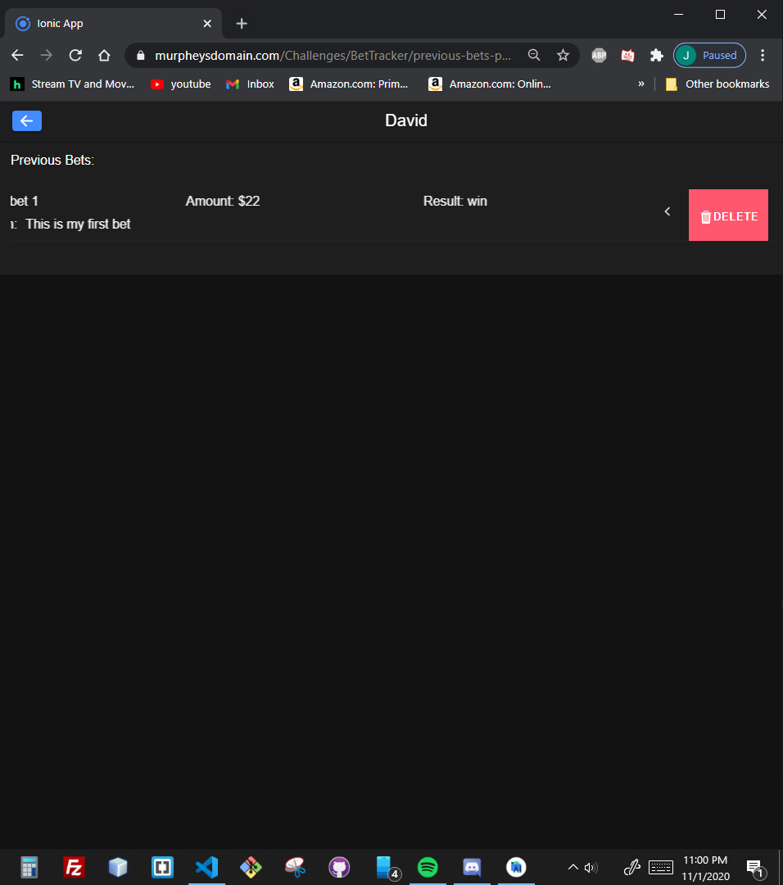

# Challenge 5: Hybrid Mobile Application by Jessie Murphey
 

## My App: Bet Tracker
- Link to code running on my web server: https://www.murpheysdomain.com/BetTrackerApp/
- The app I decided to make was a Bet Tracker application. I wanted to make this because me and my friends typically all have a bunch of friendly bets going for random stuff and it gets really hard to keep track of who owes who and how much. 
### Application Overview
- The application opens up to a Person list page where you can add new people you want to make bets with. 
- By clicking on the person in the list it takes you to the Current Bets page, this page at the top shows the person's name as well as the total amount owed/earned, and below it shows any active/ongoing bets. 
- From the Current Bets page the user can create a new bet, which takes them to a bet forum after completing it takes you back to the Current Bets page. 
- They can also conclude the bet on the Current Bets page by swiping the list to the left to open up options of complete or delete, for the bet. 
- Also from the Current Bets page the user can click on a button at the top to be taken to the Previous Bets page that is a list that shows the past bets you've had with that person and who won/lost.

- Almost all of my pages are built around the Ionic List Componenet so a lot of the research I did to create this project revolved around that.
- Some Ionic List resources I used:
    - Ionic List frameworks: https://ionicframework.com/docs/api/list
    - Ionic List frameworks: https://www.tutorialspoint.com/ionic/ionic_lists.htm
    - Ionic Item Sliding: https://ionicframework.com/docs/v3/api/components/item/ItemSliding/
    - Ionic Slider Example: https://edupala.com/ionic-slider/
    - Ionic Slider Example 2: https://www.joshmorony.com/ionic-2-how-to-create-a-sliding-delete-button-for-lists/

 

## Components

### Home Page
- This page is where the user adds new people they want to create bets with. 
- By clicking on the Add Person button an alert will appear with an input for the person's name
- The application will double check that the field is not empty and that the name is not already in use
- After creating the person the user has the ability to edit by clicking on the pencil icon on the right of the list, as well as the option to delete by clicking on the trashcan on the right.
- Clicking on the list item for the person takes the user to the Current Bet Page

### Current Bet Page
- This page is where the user can view the bets they currently have ongoing with the selected person.
- The top portion has a back button that takes the user back to the home page on the left.
- And on the right there is a button that takes the user to the Previous Bet Page.
- In the middle top it displays the selected person's name and how much money they owe/are owed.
- The bet list items show the title, amount and description
- The user has the option to complete and delete by either swiping left or clicking the arrow to show the complete/delete options
- When completing the user is prompted to choose if they won or lost the bet, the bet is then removed from the current bets view and is placed into the previous bets view and the total at the top is updated.

### Add Bet Page
- This page is a form for the user to create a new bet.
- The form takes a title, amount, and description
- At the bottom there are two buttons one to cancel and one to create
- The error checking involved is that: The title must be unique, the amount must be a number, and all the inputs must be filled out, otherwise the create button will not be enabled. Text will pop up below the inputs for the specific errors for the title and amount.

### Previous Bet Page
- This page shows the previous bets that the user has had with the selected person.
- At the top there is a back button that takes the user back to the current bets page for the selected person.
- The selected person's name is also displayed at the top
- The bets list items show the bet title, amount, result, and description
- The user has the option to delete the past bet by swiping to the left or pressing the arrow
- If the user deletes the bet it is removed from the previous bets and the total for that person is updated. (So if they earned 20 dollars on the bet then delted it, 20 dollars would be removed from the total)

### Page Not Found
- This is just a simple page that contains a link back to the home page

 

 

## Problems and Helpful Sources
- I needed help creating an ion alert to grab data
https://blog.jamibot.com/ionic-4-alert

- Had a lot of trouble getting the Current Bets Page to re-load the data after adding a new bet, I had to use the NavController to navigate to the root of the page because it was cacheing the page on router return making the new data not show up unless you refreshed.
- Resources I used to figure this out:
    - https://ionicframework.com/docs/v3/api/navigation/NavController/
    - https://stackoverflow.com/questions/51684430/ionic-4-setroot-with-angular-router
    - https://medium.com/@paulstelzer/ionic-4-and-the-lifecycle-hooks-4fe9eabb2864

- When trying to build my app on the android studio platform I kept getting the error " Failed to install the following Android SDK packages as some licences have not been accepted." I eventually had to just re-install/update my SDK manager and make sure I clicked accept on all agreements again.
Resoources I used to figure this out
- https://stackoverflow.com/questions/54273412/failed-to-install-the-following-android-sdk-packages-as-some-licences-have-not
- https://developer.android.com/studio/intro/update.html#download-with-gradle

- A helpful source I found on researching the differences between Hybrid and Native applications
    - https://clearbridgemobile.com/mobile-app-development-native-vs-web-vs-hybrid/#:~:text=Hybrid%20apps%20are%20much%20slower,saved%20with%20native%20app%20development.

 

## Hybrid vs Native

Hybrid apps can work across multiple platforms, they are a combination of a native app and a web app. A hybrid app is still built with HTML CSS and Javascript but can also run on mobile devices. Some advantages to hybrid apps are that you dont need a web browser, hybrid apps have acess to devices' interal APIs and hardware, and only one codebase is needed. Some disadvantages to hybrid application development is that hybrid apps are slower than native apps, and you are dependent on third-party platforms to deploy the applications wrapper.

Native moblie applications are built for specific platforms and are written in languages that the platform accepts, like swift/Objective-C for iOS and Java/Kotlin for Android. Native applications are also built using the specific IDE for the selected OS. Some advantages to native aplications are that they deliver the best performance compared to web and hybrid applications, they recieve full support from their respective app stores, user experience is typically better because the application is built for the specific UI and OS it is running on. Some disadvantages of native applications is that they use difficult programming languages that require experienced developers, expenses to create the application are usually higher upfront, and they are not always the best option for simple applications.
