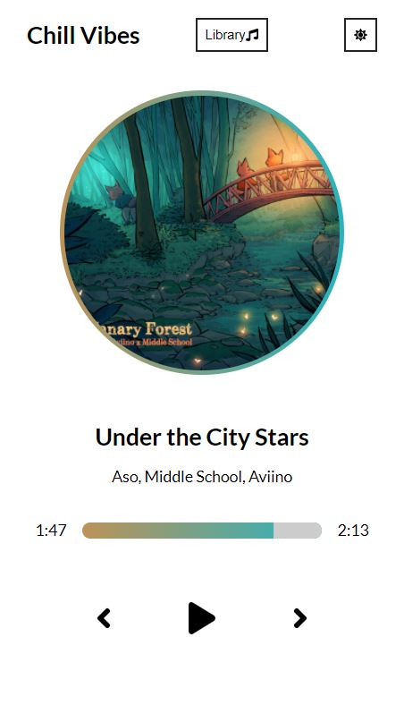
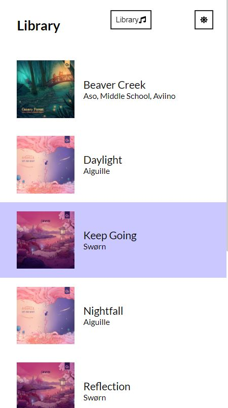
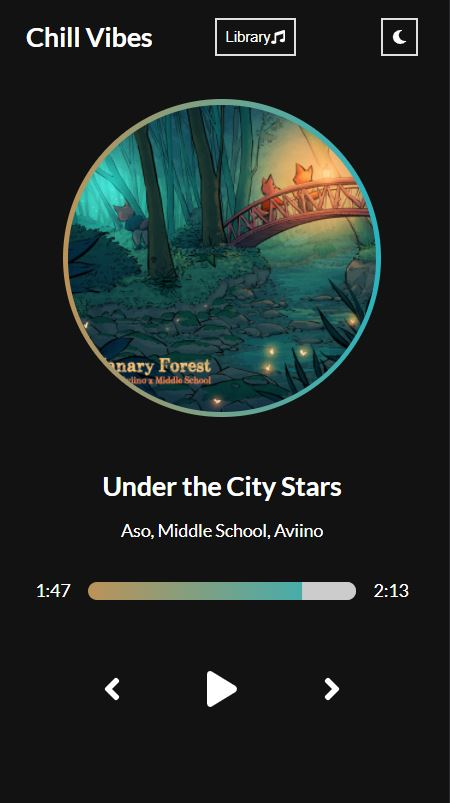
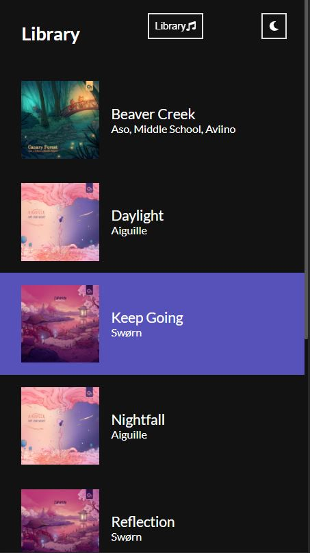

# React Music Player

### Made by Jessica Murphey

 

### [Link to Website](https://www.murpheysdomain.com/ReactMusicPlayer/)

### Description

- The purpose of this page is to present the user with a library of songs that they can choose from to play music.
- Made using React and styled with custom SCSS.
- ** This page is mobile friendly **

#### Features

- The user can:

  - Pause and play the current song.
  - Skip to the next or previous song in the library
  - Open and close the song library
  - Switch from light mode and dark mode

- The next song in the library will auto play when the current song is over.
- Each song is kept in a data.js file in JSON format.
- Each song has two colors associated with it, these colors can be seen in the album cover's border, and the time progress bar.
- The current song will be highlighted in the library.

### Screenshots

Landing Page with Light Mode (On phone)

 

Library Page with Light Mode (On phone)

 

Landing Page with Dark Mode (On phone)

 

Library Page with Dark Mode (On phone)

 
